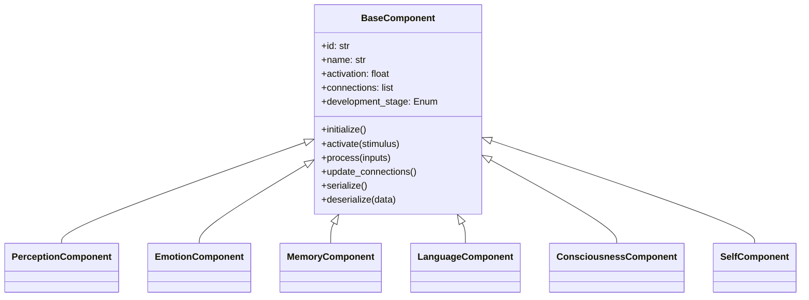
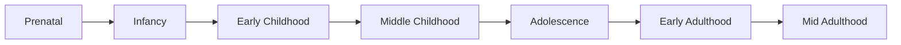
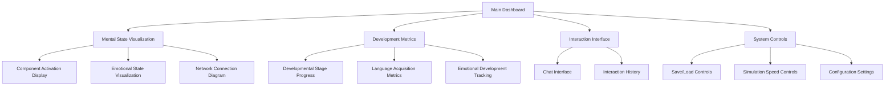

# Project NeuralChild: Implementation Plan

## System Architecture Overview

The NeuralChild project will be implemented as a modular system with these key components:

```mermaid
graph TD
    A[Configuration Module] --> B[Core Components]
    A --> C[Psychological Modules]
    A --> D[Dashboard Interface]
    A --> E[Persistence System]
    
    B --> B1[Mother Component]
    B --> B2[Neural Child]
    B --> B3[Interaction Engine]
    
    C --> C1[Perception]
    C --> C2[Emotion]
    C --> C3[Memory Systems]
    C --> C4[Language Processing]
    C --> C5[Consciousness]
    C --> C6[Self Concept]
    C --> C7[..."Other Components"...]
    
    B2 -.-> C
    B1 <--> B3
    B2 <--> B3
    
    B2 --> D
    E <--> B2
```

## 1. Core Components Implementation

### 1.1 Configuration Module (`config.py`)
- System-wide settings including:
  - Time acceleration (720x: 1 hour simulation = 30 days development)
  - Persistence options (autosave every 60 minutes)
  - Mother personality traits
  - Developmental stage parameters
  - Dashboard configuration

### 1.2 Mother Component (`core/mother.py`)
- Built around the existing LLMClient from llm_module.py
- Structured response generation using JSON schemas
- Configurable personality traits and parenting styles
- Multi-faceted responses including:
  - Verbal communication
  - Emotional states
  - Teaching elements
  - Non-verbal cues

### 1.3 Neural Child's Mind (`core/neural_child.py`)
- Main class orchestrating all psychological components
- Developmental stage management
- Input processing and response generation
- Metrics tracking and state management
- Communication protocol with Mother component

### 1.4 Interaction Engine (`core/interaction.py`)
- Facilitates structured communication between Mother and Child
- Processes Mother's responses for developmental learning
- Manages interaction sessions and cycles
- Records interaction history for analysis

## 2. Psychological Components

### 2.1 Base Component System


### 2.2 Component Implementations
- **Perception**: Processing of "sensory" inputs (text from Mother)
- **Emotion**: Modeling emotional states and responses
- **Memory**: Working, short-term, and long-term memory systems
- **Language**: Word recognition, generation, grammar acquisition
- **Consciousness**: Awareness and attention management
- **Self-Concept**: Development of identity and self-awareness

### 2.3 Interconnection Mechanism
- Dynamic connection strengths between components
- Signal propagation system
- Feedback loops for reinforcement learning
- Development-based connection formation

## 3. Developmental Framework

### 3.1 Developmental Stages


### 3.2 Stage Implementation
- Each stage defined by specific capabilities and characteristics
- Transition criteria based on developmental metrics
- Component-specific developmental trajectories
- Accelerated timeframe (720x real-time)

### 3.3 Metrics and Evaluation
- Language acquisition metrics (vocabulary size, grammar complexity)
- Emotional development metrics (stability, diversity)
- Cognitive capabilities (abstraction level, problem-solving)
- Social understanding (empathy, theory of mind)

## 4. Dashboard Interface

### 4.1 Web-based Dashboard (using Dash/Plotly)


### 4.2 Visualization Components
- Real-time component activation visualization
- Developmental metrics charts
- Network connection visualization
- Emotional state representation

### 4.3 Interaction Elements
- Chat interface (activated at appropriate developmental stage)
- Interaction history and analysis
- Configuration controls
- State management interface

## 5. Persistence System

### 5.1 State Serialization
- Complete system state serialization 
- Support for JSON and pickle formats
- Efficient storage of complex interconnected state

### 5.2 Checkpoint Management
- Automatic saving at configurable intervals (default: 60 minutes)
- Named checkpoint system
- Restoration from specific developmental points

### 5.3 Analytics Storage
- Long-term storage of developmental metrics
- Interaction history preservation
- Performance and progress analysis capabilities

## 6. File Structure

```
NeuralChild/
├── config.py                  # System-wide configuration
├── app.py                     # Main application entry point
├── llm_module.py              # LLM client for Mother (existing)
├── core/
│   ├── __init__.py
│   ├── mother.py              # Mother component
│   ├── neural_child.py        # Main Neural Child class
│   └── interaction.py         # Interaction engine
├── components/
│   ├── __init__.py
│   ├── base.py                # Base component class
│   ├── perception.py          # Perception component
│   ├── emotion.py             # Emotion component
│   ├── memory.py              # Memory systems
│   ├── language.py            # Language processing
│   ├── consciousness.py       # Consciousness component
│   └── self_concept.py        # Self-concept component
├── development/
│   ├── __init__.py
│   ├── stages.py              # Developmental stages
│   ├── metrics.py             # Development metrics
│   └── evaluation.py          # Stage progression evaluation
├── dashboard/
│   ├── __init__.py
│   ├── app.py                 # Dash application
│   ├── layouts.py             # Dashboard layouts
│   ├── callbacks.py           # Dashboard interactivity
│   └── visualizations.py      # Visualization components
├── utils/
│   ├── __init__.py
│   ├── persistence.py         # Persistence utilities
│   ├── analytics.py           # Analytics utilities
│   └── validation.py          # Data validation utilities
└── tests/                     # Unit and integration tests
```

## 7. Implementation Timeline

### Phase 1: Foundation (Week 1-2)
- Set up project structure and configuration
- Implement Mother component
- Create base psychological component framework
- Develop basic persistence system

### Phase 2: Psychological Components (Week 3-4)
- Implement core psychological components
- Develop interconnection mechanism
- Create initial developmental stages framework
- Build basic metrics tracking

### Phase 3: Learning & Development (Week 5-6)
- Implement interaction engine
- Develop language acquisition system
- Create emotional development framework
- Build full developmental stage progression

### Phase 4: Dashboard & UI (Week 7-8)
- Implement Dash-based dashboard
- Create visualization components
- Develop interaction interface
- Build system controls

### Phase 5: Refinement & Testing (Week 9-10)
- Optimize performance
- Refine developmental mechanisms
- Enhance visualization capabilities
- Comprehensive testing and validation

## 8. Technical Considerations

### Performance Optimization
- Efficient component activation and propagation
- Optimized state serialization for large state spaces
- Intelligent memory management for long-running simulations

### Extensibility
- Plugin architecture for new psychological components
- Configurable developmental trajectories
- Customizable Mother personality traits

### Testing & Validation
- Unit tests for individual components
- Integration tests for system interactions
- Developmental milestone validation